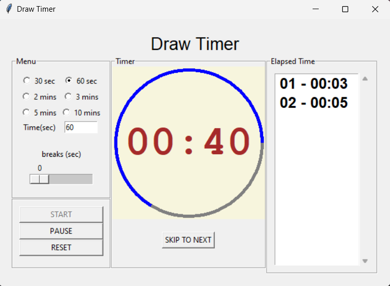

# draw_timer
A simple timer specially for when praticing drawing or just about anything and you want to keep track of the time

## featues
- options to select dynamically (even while the app is running) different time count for your practice
- Option to skip to the next drawing if say you finished on early than the time alocated
- Elapsed time to keep track of how much time you've spent on each section
- Break(sec) to give breathing time between sessions
  

